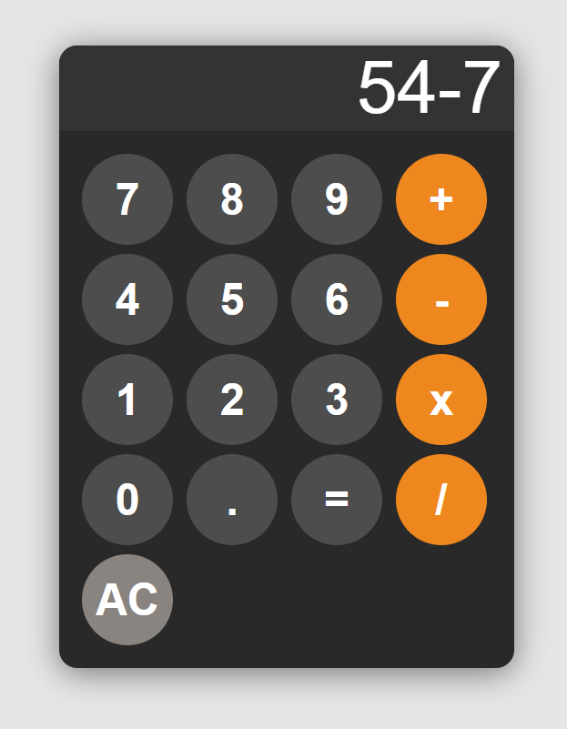

# Calculator App

This is a simple yet elegant calculator app built with HTML, CSS, and JavaScript. The app provides basic arithmetic operations and a clean, modern design.

## Features

- Basic arithmetic operations: addition, subtraction, multiplication, and division
- Responsive design
- Smooth transitions and animations
- Error handling for invalid inputs

## Demo



## Installation

1. Clone the repository:
    ```sh
    git clone https://github.com/yourusername/calculator-app.git
    ```

2. Navigate to the project directory:
    ```sh
    cd calculator-app
    ```

3. Open the `index.html` file in your browser to view the calculator.

## CSS Highlights

- Flexbox and Grid for layout
- Transitions for smooth hover and click effects
- Custom colors using HSL for a modern look

## JavaScript Highlights

- Handling basic arithmetic operations
- Error handling for invalid inputs
- Ensuring results are displayed with up to 3 significant digits
